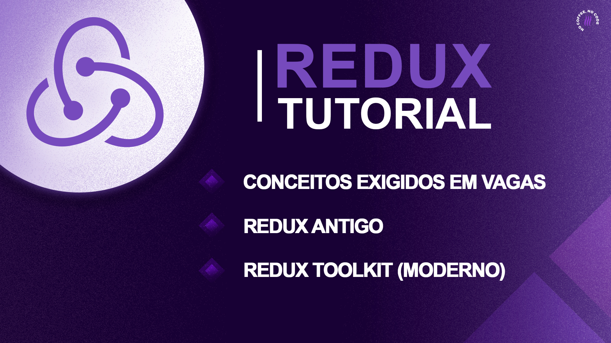

<h2>Redux do CONCEITO a PRÁTICA! Migrando Redux Antigo para Redux Toolkit  
</h2>

 

Este projeto foi construído para o vídeo [Redux do CONCEITO a PRÁTICA! Migrando Redux Antigo para Redux Toolkit (Tutorial)](https://youtu.be/HGMd3dbB-lM) em nosso canal no YouTube.

### O que você aprenderá nesse tutorial?

- <b>Os principais conceitos exigidos para vagas de emprego</b>. Entenderá o que é uma `Action`, um `Reducer` e um `Store`. Aprenderá os conceitos de dispatch e global state e como tudo isso se comunica no que chamadas de Data Flow do Redux.
   
- <b>Como implementar o Redux em seu aplicativo ReactJS ou React Native</b>. Verá primeiro o modo "antigo" com uso do HOC `connect`, e a realizar os famosos `mapStateToProps` e `mapDispatchToProps`.
   
- Substituir os items citados acima pelos hooks `useSelector` e `useDispatch`.
   
- <b>Aprenderá a nova forma de usar a biblioteca, o Redux Toolkit</b>, faremos isso através da migração do Redux Antigo implementado no passo anterior. Para isso usaremos as função `createSlice` e `configureStore`.

### ✅ VOCÊ TAMBÉM VAI GOSTAR DESSES VÍDEOS:

▸ [React Query Tutorial em TypeScript - Queries, Mutations e Query Invalidation](https://youtu.be/lg0K1UpZKlI)

▸ [TypeScript - Por Que Usar? TypeScript vs JavaScript na PRÁTICA! (Tutorial)](https://youtu.be/mo7MZFYYzWM)

▸ [Playlist DICAS de CARREIRA](https://youtube.com/playlist?list=PLn1L40VzKSVLsz6FNb3NrmWLyxs0Eljgx)

## Redes Sociais:

- Instagram: @lucasgar6 https://www.instagram.com/lucasgar6/
- Instagram: @coffstack https://www.instagram.com/coffstack/
- TikTok: @coffstack https://www.tiktok.com/@coffstack
- Twitter: @coffstack https://twitter.com/coffstack
- Blog/Artigos: https://blog.coffstack.com/
